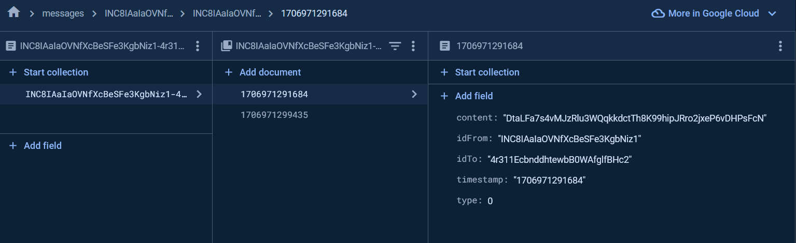

# Firebase Encrypted Chat App (Flutter/Dart)
### packages :
### encrypt,firebase_core and more...
## Before start :
#### -Create a new Firebase project and replace the google-services.json file and make Firebase setup; otherwise, it will not work.

#### -Run this command in the terminal to get the dependencies: 'flutter pub get'.

#### -And make sure the quill package is up-to-date.

### This is how messages appear in the database

For more help please contact me on my email: malkoceren24@gmail.com

 
