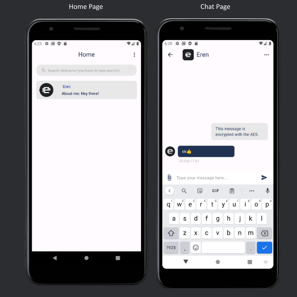

# Firebase Encrypted Chat App

A secure chat application built with Flutter/Dart that utilizes Firebase for backend services. This application incorporates encryption for secure message transmission.

## Packages Used

- **encrypt**: Library for encrypting messages
- **firebase_core**: Core Firebase services
- Additional dependencies as required

## Getting Started

### Prerequisites

Ensure you have the following installed:

- Flutter SDK: [Install Flutter](https://flutter.dev/docs/get-started/install)
- Firebase account: [Get Started with Firebase](https://firebase.google.com/docs/web/setup)

### Setup Instructions

1. **Create a New Firebase Project:**
   - Go to the [Firebase Console](https://console.firebase.google.com/), create a new project, and follow the setup instructions.

2. **Add Google Services File:**
   - Download the `google-services.json` file from your Firebase project settings and replace the existing one in your Flutter project.

3. **Install Dependencies:**
   - Run the following command in the terminal to install the required Flutter packages:
     ```bash
     flutter pub get
     ```

### Screenshots

#### Application Screens



### Database Structure

This is how messages appear in the database:


### Support

For any questions or assistance, please feel free to contact me via email: [malkoceren24@gmail.com](mailto:malkoceren24@gmail.com).


